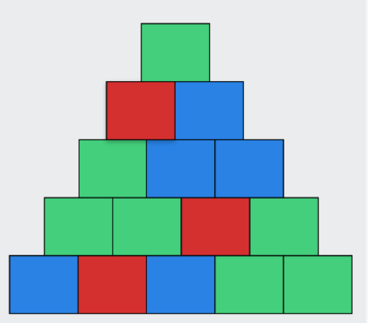

现在有一个奇特的金字塔，绝大部分人都想攀爬上去，领略顶部的风景，看看顶部的方块是什么颜色。但绝大部分碍于高度太高，都放弃了。但是聪明的你，通过观察发现，金字塔的颜色变化是有一定规律的。

规律$1$. 若相邻的两块方砖是相同颜色，那么这两块方砖紧挨的上面的砖块也将会是相同的颜色

规律$2$. 若相邻的两块方砖是不同颜色，那么这两块方砖紧挨的上面的砖块将会是没有出现的第三种颜色

规律$3$. 金字塔的颜色只有红绿蓝三种。


现在你能推测出，金字塔顶部的颜色是什么吗？

### 输入格式:

第一行输入两个正整数 $N$ ，代表字符串长度和最多操作次数  $(1≤N≤2\times 10 ^ 5)$

第二行输入长度为 $N$ 的字符串 $S$ ，字符串仅由颜色的首字母 ‘B’、‘G’、‘R’ 构成

### 输出格式:

输出金字塔顶端的颜色首字母

### 输入样例:

```in

5

BRBGG

```

### 输出样例:

```out

G

```

### 输入样例:

```in

4

RBRB

```

### 输出样例:

```out

G

```

### 样例解释：

样例1.题目描述中有图片解释